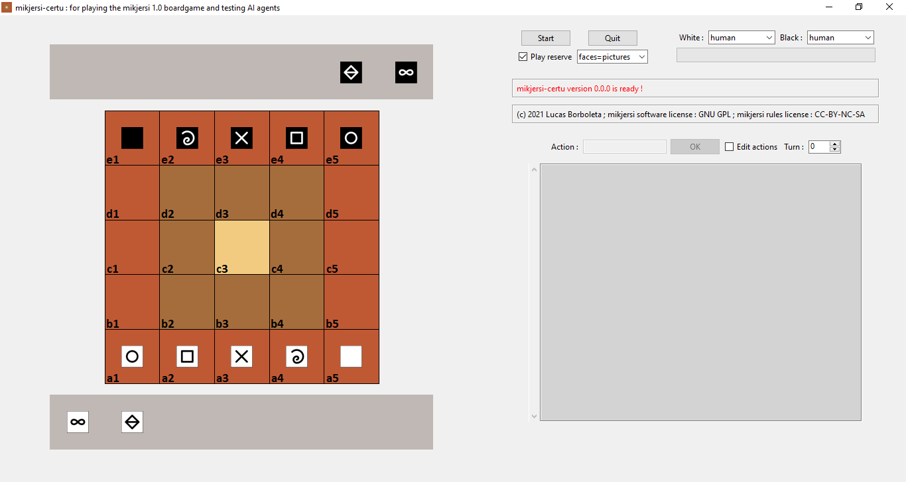
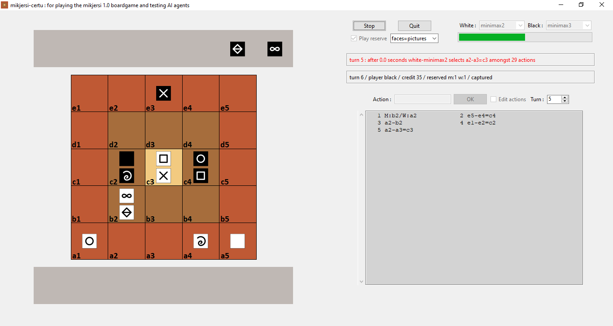

# Mikjersi certu

The Python package *mikjersi_certu* provides a GUI and a rules engine for playing the *Mikjersi* board-game, which is a micro-variant of [*Jersi*](https://github.com/LucasBorboleta/jersi) board-game. The rules of Mikjersi are those of Jersi, but with the following changes:

-     **Board** :The board is made of 5x5 squared cells.

-     **Moves** : The moves are only vertically and horizontally, but not along diagonal.

-     **Cubes** : Each player owns 1 cube of each sort:
      -     1 mountain and 1 wise man that start in the reserve.

      -     1 rock, 1 paper, 1 scissors, 1 fool and 1 king that start on the first row of each side.

-     **Setting phase** : At the beginning, the board is empty. Starting with whites, and alternating turns, each player puts a cube on his first row. The mountain and wise man are kept in the reserve. After this phase, the play continues as in Jersi.

-     **Exchange of prisoners** : When a player captures a cube whose sort exist as prisoner by his opponent, then those prisoners are immediately exchanged and moved into the respective reserves.

-     **Drop** : Each piece of the reserve, including retrieved prisoners, can be dropped.

Below is an overview of the GUI interface. This is a work in progress.

*mikjersi_certu* is being developed on Windows and should be portable on Linux. For running it on your computer read the [**INSTALL**](./docs/INSTALL.md) instructions.

If you intent to derive or to sell either a text, a product or a software from this work, then read the [**LICENSE**](./docs/LICENSE.txt) and the  [**COPYRIGHT**](./docs/COPYRIGHT.md)  documents.

